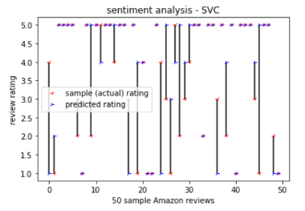
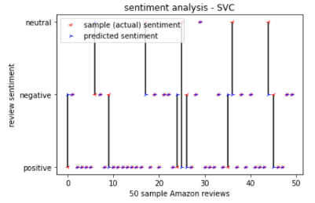
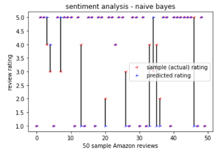
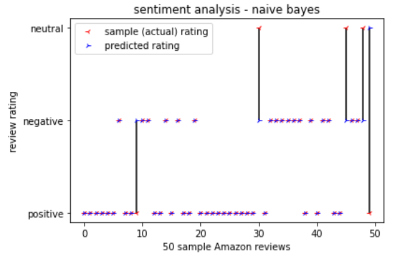

## Amazon review sentiment analysis & jeopardy question classification models

### Red stars are sample results (rating or sentiment depending on the model). It represents the ACTUAL result. Blue stars are the predicted results. When a red and blue star overlap it means the prediction is correct. If they don't overlap it means the prediction is wrong and a vertical line is drawn connecting the stars to visually indicate an incorrect prediction. There are thousands of of reviews, but only 50 are plotted for simplicity. 

#### Using a support vector classifier to predict ratings (1-5 star)

#### Using a support vector classifier to predict review sentiments

#### Using a naive bayes to predict ratings (1-5 star)

#### Using naive bayes to predict review sentiments

